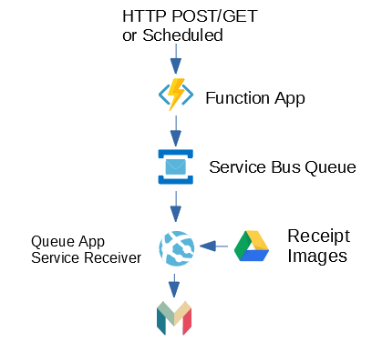
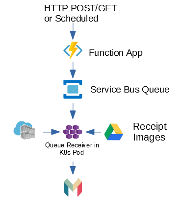

# Monzo Receipt Matcher .NET Core

This combines Monzo with a Google Drive folder that scans for new receipt images files and matches them with the correct transacition.

### How it works:
1. A Receipt Image is added to the folder with the naming style "[MerchantName]-[Amount].png" e.g. "Lidl-5-50.png".

2. A HTTP POST to a function app triggers a message to be send on a service bus queue.

3. Service Bus Reader checks the queue and if there is a message, the method is triggered to check a specificed google drive folder for new images

4. If a Monzo match is found, the image is uploaded to blob storage and linked to Monzo.

## K8s Integration

This application is Docker friendly. When run with Kubernetes a health check is added to check that the connection to the service bus is working and will restart the pod if an error is found.

